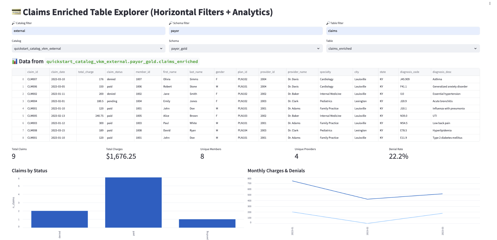

***

# Payor Analytics Dashboard — Databricks App

**Authors:** Vik Malhotra, Jaideep Patel  
**Prerequisite Data Pipeline:** [Payer Medallion Project](https://github.com/bigdatavik/payer_dlt)

***

## Overview

A modern, interactive Streamlit dashboard for healthcare payor analytics, built as a Databricks App.  
This app lets you instantly explore claims data, analyze cost drivers, understand denial trends, identify provider performance, and spotlight outlier activity — all on governed Unity Catalog production data.

**Key Features**
- Horizontal, filterable selectors for catalog, schema, and table
- Metrics row for executive KPIs (claims, charges, denial rate, member/provider count)
- Claims workflow and status breakdown
- Denials analysis, provider leaderboard, diagnosis insights, and outlier detection
- Modular, extensible code — adapt for your own analytics needs

***

## Prerequisite

This dashboard expects a high-quality `claims_enriched` gold table generated by our **Payer Medallion** medallion-architecture claims pipeline.
Start here if you need a production-grade healthcare payor claims dataset:  
➡️ [Payer Medallion Repo](https://github.com/bigdatavik/payer_dlt)

***

## Quickstart

**1. Clone this repo**
```bash
git clone https://github.com/bigdatavik/payer-app
cd payer-app
```

**2. Install dependencies**
```bash
pip install -r requirements.txt
```
(Minimum required: `streamlit`, `pandas`, `databricks-sql-connector`, `databricks-sdk`, `pyarrow`)

**3. Configure environment**  
- Ensure your Databricks SQL warehouse is running and your environment variables are set for authentication (see “Deployment” below).

**4. Run the app**
```bash
streamlit run app.py
```
- Select your Unity Catalog catalog/schema/table and begin exploring analytics!

***

## Screenshots



***

## Why Databricks Apps vs. Classic Dashboards?

- **Dashboards** are great for static BI and periodic reporting.
- **Databricks Apps** enable secure, interactive, code-driven analytics directly on Lakehouse data, with richer logic, user workflows, and fine-grained governance.

***

## Deployment on Databricks Apps

1. Package the app per [Databricks Apps documentation](https://docs.databricks.com/en/dev-tools/databricks-apps/index.html).
2. Specify any required environment variables in your `app.yaml` (e.g. `DATABRICKS_WAREHOUSE_ID`, `DATABRICKS_TOKEN`).
3. Attach app resources and env vars in the Apps UI, or define them in `app.yaml`.
4. Start/redeploy your app using the UI as needed.

***

## Contributing

Contributions, issues, and feature requests welcomed!  
Please open a Pull Request, file an Issue, or contact the authors for serious collaboration.

***

## License

This project is open source.

***

## Related Resources

- [Payer Medallion Project (gold table ETL)](https://github.com/bigdatavik/payer_dlt)
- [Medium article: From Raw Claims Data to Actionable Payer Insights](https://medium.com/@vikram.malhotra/from-raw-claims-data-to-actionable-payer-insights-33bac61d314f)

***

**For questions or demos, please reach out or open an issue!**
